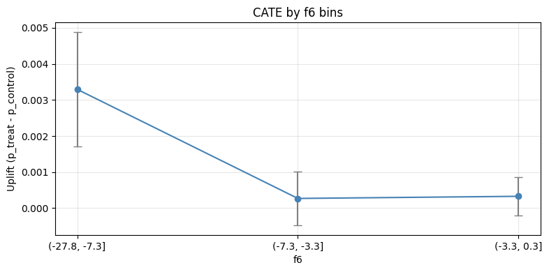
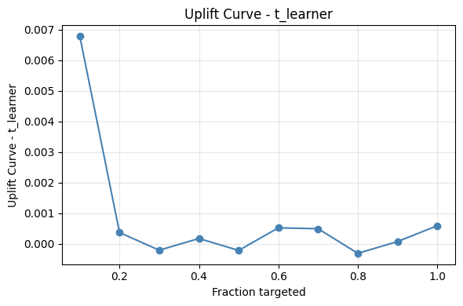
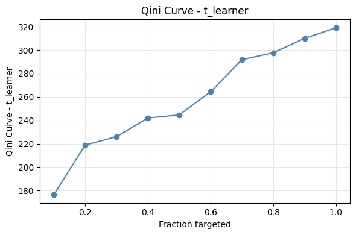

# Uplift Modeling — Criteo Dataset

## Setup

```bash
python3 -m venv .venv
source .venv/bin/activate
pip install -r requirements.txt
```

## Data
Data source: [Criteo Uplift Prediction Dataset](https://ailab.criteo.com/criteo-uplift-prediction-dataset/). Please review the license and cite the dataset/paper accordingly.

### Dataset description

- Purpose: large-scale public dataset for evaluating uplift/causal response models in advertising.
- Scale: millions of rows (raw CSV is several GB; Parquet recommended for iteration).
- Columns used in this project (renamed/standardized in code):
  - `treatment` (binary): 1 if exposed to the campaign, 0 otherwise.
  - `conversion` (binary): 1 if converted, 0 otherwise. Often highly imbalanced.
  - `f0` … `f11` (numeric): anonymized covariates used as features.
- Files and formats:
  - Raw: `.csv.gz` compressed file from the Criteo page.
  - Extracted: `.csv` (very large; used only for one-time conversion).
  - Optimized: `.parquet` (columnar, faster load/compute). Default path: `data/criteo-uplift-v2.1.parquet`.
- Notes:
  - The project expects the column names above. If your raw file uses different names, adjust in `pipeline.py` or during preparation.
  - Outcomes are rare; confidence intervals and stratified subsampling can help with faster, stable iteration.

### One-time download, extract, and CSV → Parquet conversion
Use the standalone script to download the `.csv.gz` (if not present), extract to CSV, and convert to Parquet.

```bash
# Default: uses the Criteo dataset page to auto-resolve the .csv.gz
python src/etl/prepare_dataset.py \
  data/criteo-uplift-v2.1.csv \
  data/criteo-uplift-v2.1.parquet \
  --chunksize 1000000

# Or specify a direct .csv.gz URL explicitly
python src/etl/prepare_dataset.py \
  data/criteo-uplift-v2.1.csv \
  data/criteo-uplift-v2.1.parquet \
  --download-url "https://example.com/criteo-uplift-v2.1.csv.gz" \
  --chunksize 1000000
```

Notes:
- If you already have `data/criteo-uplift-v2.1.csv.gz`, the script will extract it.
- If you already have the CSV, it will skip download/extract and go straight to conversion.
- Use `--gz-path` to control where the `.gz` is saved/read.
- Use `--overwrite` to rebuild Parquet if it exists.
 - Deduplication:
   - `--drop-duplicates-in-chunks` removes duplicates within each CSV chunk before writing.
   - `--final-dedupe` loads the written Parquet and drops duplicates globally (slower, more thorough).
   - `--dedupe-subset col1,col2` to define duplicates by subset of columns (default: all columns).
   - `--deduped-parquet path.parquet` to write the deduped output to a separate file.


## Pipeline steps

- **prepare**: Downloads (if needed), extracts `.csv.gz`, and converts CSV → Parquet with optional chunked deduplication. Saves `data/criteo-uplift-v2.1.parquet`.
- **balance**: Compares treatment vs control covariate distributions using KS tests; saves raw results and imbalance summary; generates feature and balance plots. Artifacts under `reports/balance/` and `reports/plots/{features,balance}/`.
- **baseline**: Estimates ATE via naïve difference-in-means and logistic-regression-adjusted model. Saves `reports/baseline/baseline_results.csv` with ATE, SE, 95% CI, and group sizes.
- **heterogeneity**: Computes CATE by binning features (quantiles) and estimating per-bin uplift with 95% CI; saves CSV and plots under `reports/heterogeneity/` and `reports/plots/heterogeneity/`.
- **propensity**: Estimates propensity scores (logit or XGBoost) and computes ATE via IPW and nearest-neighbor matching; saves `reports/propensity/propensity_results.csv`.
- **uplift**: Trains T-/X-learners (optional Causal Forest if available), outputs uplift and Qini curves, per-user uplift scores, Qini and uplift AUC, and incremental conversions at top-k%. Artifacts under `reports/uplift/` and `reports/plots/uplift/`.
- **all**: Runs all steps in sequence. When `--subsample` is set, each step uses its own stratified subsample size for faster iteration.

Run steps via `pipeline.py`:

```bash
# Prepare data (download/extract/convert)
python pipeline.py --step prepare

# Balance diagnostics (KS tests, summaries, plots)
python pipeline.py --step balance --log-level INFO

# Full run (no interactive plots; images saved under reports/plots/)
python pipeline.py --step all --log-level INFO

# Optional: per-step stratified subsampling (faster dev runs)
python pipeline.py --step all --subsample --log-level INFO

# Heterogeneity (CATE) only
python pipeline.py --step heterogeneity --subsample --log-level INFO

# Propensity methods (IPW + Matching)
python pipeline.py --step propensity --subsample --log-level INFO

# Uplift models (T-/X-learner, optional Causal Forest)
python pipeline.py --step uplift --subsample --log-level INFO
```

Artifacts:
- Baseline CSV: `reports/baseline/baseline_results.csv`
- CSVs: `reports/balance/balance_results.csv`, `reports/balance/balance_summary.csv`
- CATE CSV: `reports/heterogeneity/cate_results.csv`
- Propensity CSV: `reports/propensity/propensity_results.csv`
- Uplift: per-user scores `reports/uplift/uplift_scores_<method>.parquet`, summary `reports/uplift/uplift_results.csv`
- Plots: `reports/plots/features/*.png`, `reports/plots/balance/*.png`, `reports/plots/heterogeneity/*.png`, `reports/plots/uplift/*.png`

### Heterogeneity (CATE) details

- Binning: features are split into quartiles (or fewer bins if low cardinality). Numeric bin labels show interval endpoints rounded to 1 decimal (e.g., `(0.1, 2.3]`).
- Estimation: uplift per bin is computed via difference-in-means (probability difference) with 95% Wald confidence intervals.
- Outputs:
  - CSV `reports/heterogeneity/cate_results.csv` includes: `feature`, `bin_label`, `bin_index`, `n_treat`, `n_control`, `p_treat`, `p_control`, `uplift`, `ci_low`, `ci_high` (floats rounded to 4 decimals).
  - Plots under `reports/plots/heterogeneity/` show uplift by bin with error bars (95% CI) and grids enabled.

### Propensity methods

- Propensity score estimation via logistic regression (optionally XGBoost if installed).
- Methods implemented:
  - IPW: inverse probability weighting ATE with robust SE and 95% CI.
  - Matching: nearest-neighbor (k=1 by default) on standardized features, ATE with SE and 95% CI.
- Results saved to `reports/propensity/propensity_results.csv`.

### Uplift modeling

- T-Learner, X-Learner (optionally Causal Forest via CausalML if available).
- Outputs:
  - Per-user uplift scores: `reports/uplift/uplift_scores_<method>.parquet`.
  - Curves: Uplift and Qini under `reports/plots/uplift/`.
  - Summary: `reports/uplift/uplift_results.csv` with:
    - `qini`, `uplift_auc` (model comparison)
    - `incr_conv_top10`, `incr_conv_top20`, `incr_conv_top30` — incremental conversions when targeting the top 10/20/30% by predicted uplift. Computed as `N_treat * (p_treat - p_ctrl)` within each top-k% subgroup.

Business interpretation: “If I only target the top-k% highest uplift users, how many extra conversions do I gain over control?”

## Project Structure
```
├── data/
├── notebooks/
├── reports/
│   ├── balance/
│   │   ├── balance_results.csv
│   │   └── balance_summary.csv
│   ├── heterogeneity/
│   │   └── cate_results.csv
│   └── plots/
│       ├── features/
│       ├── balance/
│       ├── heterogeneity/
│       └── uplift/
├── src/
│   ├── eda/
│   │   ├── balance.py
│   │   └── visualize.py
│   ├── estimation/
│   │   ├── baseline.py
│   │   ├── heterogeneity.py
│   │   ├── propensity.py
│   │   └── uplift.py
│   └── etl/
│       └── prepare_dataset.py
├── pipeline.py
├── requirements.txt
└── README.md
```


# Results

## 1. Balance Diagnostics

We compared treatment vs control covariate distributions using **Kolmogorov–Smirnov (KS) tests**. To go beyond raw test statistics, we defined a **confounding risk level** per feature:

* **High** risk: Feature shows both notable imbalance (KS ≥ 0.01) and correlation with the outcome (|corr| ≥ 0.1).
* **Moderate** risk: Feature shows either imbalance or correlation, but not both.
* **Low** risk: Feature shows neither imbalance nor correlation.

This classification was implemented in `confounding_risk_table()`, which combines the KS statistics with correlations against the conversion label.

**Findings:**

| Feature | KS Stat | p-value | Confounding Risk |
| ------- | ------- | ------- | ---------------- |
| f6      | 0.0497  | 0.0000  | Moderate         |
| f8      | 0.0387  | 0.0000  | Moderate         |
| f3      | 0.0307  | 0.0000  | Moderate         |
| f9      | 0.0254  | 0.0000  | Moderate         |
| f2      | 0.0185  | 0.0000  | Moderate         |
| f0      | 0.0173  | 0.0000  | Moderate         |
| f5      | 0.0111  | 0.0147  | Moderate         |
| f7      | 0.0111  | 0.0147  | Moderate         |
| f10     | 0.0087  | 0.0979  | Low              |
| f4      | 0.0086  | 0.1029  | Low              |
| f11     | 0.0030  | 0.9925  | Low              |
| f1      | 0.0029  | 0.9968  | Low              |


* We can see features classified as **Low risk**, suggesting good randomization.
* Some features (notably **f6, f8, f3**) are **Moderate risk**, due to noticeable imbalance even if not strongly correlated with conversions.
* No feature crossed both thresholds simultaneously, so **no High-risk confounders** were detected.

This means that randomization was largely successful. However, adjusting for **moderate-risk features** in downstream analyses (e.g. via propensity scores or uplift models) can further reduce residual bias, ensuring the campaign's uplift estimates are robust.

## 2. Baseline Causal Effect Estimates

To establish a reference point, we estimated the **Average Treatment Effect (ATE)** using two approaches:

### Methods

* **Naïve difference in means (`diff_in_means`)**
  Computes the raw conversion rate difference between treatment and control groups, with a Wald 95% CI.

* **Logistic regression with covariates (`logistic_adjusted_ate`)**
  Fits a model:

  logit(P(conversion)) = β₀ + β_w · treatment + β_X · X

  The treatment coefficient (β_w) is interpreted as the causal effect after adjusting for observed features. We report:

  * **coef_w**: treatment coefficient (log-odds scale).
  * **odds_ratio**: exponentiated coefficient.
  * **ate_prob_diff**: approximate average probability difference (ATE on outcome scale).

* *(Optional)* **CUPED adjustment (`cuped_adjustment`)** can be used if pre-treatment outcomes are available, to reduce variance via covariance adjustment.

### Results

| Method              | ATE (prob diff) | SE     | 95% CI            | n_treat | n_control | coef_w | Odds Ratio |
| ------------------- | --------------- | ------ | ----------------- | ------- | --------- | ------ | ---------- |
| Naïve diff-in-means | 0.0014          | 0.0001 | [0.0012, 0.0017]  | 835,377 | 164,623   | –      | –          |
| Logistic adjusted   | 0.0009 (approx) | 0.0603 | [0.2158, 0.4523]* | 835,377 | 164,623   | 0.3341 | 1.397      |

*95% CI shown here is for the **log-odds coefficient**; the corresponding probability-scale interval is narrower, but less straightforward to compute analytically.

* **Naïve ATE**: The campaign increased conversions by about **0.14 percentage points** (from a baseline ~0.23% conversion rate, this is a relative lift of ~60%). With millions of users, this difference is highly statistically significant.
* **Logistic adjusted ATE**: After adjusting for user features, the estimated effect drops slightly (~0.09 percentage points). The odds ratio of **1.40** indicates that treated users are ~40% more likely to convert than controls, holding covariates constant.
* The wide CI in the logistic regression output (on the log-odds scale) reflects the fact that conversions are rare events, making coefficient estimates noisier. Still, the point estimates support a **positive and meaningful incremental effect** of the campaign.

Even the simplest baseline comparison shows the campaign is effective. However, adjusted estimates suggest the effect is somewhat smaller after accounting for covariates — underlining the importance of **covariate adjustment** to avoid overstating ROI.


## 3. Heterogeneous Treatment Effects (CATE)

To investigate whether the campaign effect varies across user segments, we computed **Conditional Average Treatment Effects (CATE)** by binning each feature into quantiles and estimating uplift within each bin.

### Methods

* Features were binned into 4 quantiles (`pd.qcut` by default).
* Within each bin, we estimated:
  
  uplift = P(conversion | treat=1) − P(conversion | treat=0)

  along with a 95% Wald confidence interval.
* Outputs were saved as both CSV (`reports/heterogeneity/cate_results.csv`) and per-feature plots (`reports/plots/heterogeneity/`).

### Results (sample highlights)

| Feature | Bin           | n_treat | n_control | p_treat | p_control | Uplift      | 95% CI            |
| ------- | ------------- | ------- | --------- | ------- | --------- | ----------- | ----------------- |
| **f0**  | (12.6, 21.8]  | 126k    | 23.9k     | 0.0066  | 0.0043    | **+0.0023** | [0.0014, 0.0033]  |
| f0      | (24.4, 26.7]  | 62k     | 12.7k     | 0.0006  | 0.0006    | ~0.0        | [-0.0005, 0.0004] |
| **f6**  | (-27.8, -7.3] | 66k     | 11.2k     | 0.0091  | 0.0058    | **+0.0033** | [0.0017, 0.0049]  |
| f6      | (-3.3, 0.3]   | 115k    | 25.2k     | 0.0018  | 0.0014    | +0.0003     | [-0.0002, 0.0009] |
| **f8**  | (3.6, 3.9]    | 66k     | 11.3k     | 0.0133  | 0.0100    | **+0.0033** | [0.0013, 0.0053]  |
| f8      | (3.9, 4.0]    | 184k    | 38k       | 0.0003  | 0.0002    | +0.0001     | [-0.0001, 0.0002] |

(full CSV [here](reports/heterogeneity/cate_results.csv))

* **Strong uplift segments exist**. For example, users in lower ranges of **f6** or **f8** show incremental conversion lifts of ~0.3 percentage points — more than double the overall ATE.
* **Flat/no effect bins**: Some bins (e.g. `f0` in (24.4, 26.7]) show negligible or zero uplift, suggesting these users are less influenced by the campaign.
* **Implication for targeting**: By focusing spend on high-uplift segments (e.g. f6 low, f8 narrow bands), marketers could achieve substantially higher ROI.

Not all users respond equally. While the global uplift is ~0.15pp, certain subgroups respond much more strongly, meaning **segment-level targeting could improve efficiency by 2–3×** compared to blanket campaigns.




## 4. Propensity-Based Causal Estimates

To further reduce potential bias from residual imbalances, we estimated the ATE using **propensity score methods**.

### Methods

* **IPW (Inverse Probability Weighting)**

  * Fit a logistic regression to estimate the probability of treatment given covariates:

    e(X) = P(T=1 | X)
    
  * Weight treated users by 1 / e(X) and controls by 1 / (1 − e(X)).
  * Provides an unbiased ATE estimate if the propensity model is correctly specified.

* **Nearest-neighbor Matching**

  * Standardized features and matched each treated user with the closest control(s), and vice versa.
  * Computed ATE as the mean difference in outcomes across matched pairs.
  * Uses (k=1) neighbor by default for tighter matches.

### Results

| Method       | ATE (prob diff) | SE     | 95% CI           | n_treat | n_control |
| ------------ | --------------- | ------ | ---------------- | ------- | --------- |
| **IPW**      | 0.0008          | 0.0002 | [0.0005, 0.0011] | 835,377 | 164,623   |
| **Matching** | 0.0011          | 0.0002 | [0.0007, 0.0016] | 83,538  | 16,462    |


* Both methods confirm a **positive campaign effect**, consistent with baseline estimates.
* **IPW** is slightly more conservative (~0.08 percentage points lift).
* **Matching** produces an estimate closer to the naïve ATE (~0.11 percentage points), suggesting that covariates did not introduce strong hidden bias.
* Confidence intervals are tight and overlap across methods, supporting robustness.

Even after adjusting for covariates via propensity methods, the incremental lift remains positive. This strengthens confidence that the observed effect is **causal rather than spurious**, meaning the campaign is indeed driving conversions.


## 5. Uplift Modeling

Finally, we applied **causal machine learning models** to estimate individualized treatment effects (uplift) and evaluate campaign targeting strategies.

### Methods

* **T-Learner**: trains separate models for treated vs. control users, then predicts uplift as the difference.
* **X-Learner**: imputes treatment effects for each group and blends them using propensity weights.
* *(Optional)* **Causal Forest**: to be added in the future.

Each model outputs per-user **uplift scores**. We evaluate models using:

* **Qini coefficient**: area under the Qini curve (higher = better targeting).
* **Uplift AUC**: area under the uplift curve.
* **Incremental conversions at top-k%**: extra conversions if targeting the top 10/20/30% of users ranked by predicted uplift.

### Results

| Method    | Qini      | Uplift AUC | incr@10% | incr@20% | incr@30% |
| --------- | --------- | ---------- | -------- | -------- | -------- |
| T-Learner | **234.3** | 0.0005     | **177**  | 219      | 226      |
| X-Learner | 223.7     | 0.0004     | 145      | 196      | 215      |

* Both uplift models identify **incremental conversions beyond average targeting**.
* The **T-Learner performed slightly better** (higher Qini, more incremental conversions in top 10%).
* The gain is most pronounced in the **top 10% segment** (177 extra conversions vs 145 for X-Learner).
* Incremental benefit flattens as more users are targeted (diminishing returns).

Instead of treating all users equally, **targeting only the top decile by uplift score yields ~177 additional conversions** compared to random targeting. This demonstrates the practical ROI of uplift modeling: the company could allocate budget more efficiently, focusing spend on the most responsive users.





## Citation
If you use this dataset, please cite:

Diemert, E., Betlei, A., Renaudin, C., & Amini, M.-R. (2018). A Large Scale Benchmark for Uplift Modeling. AdKDD 2018.

BibTeX:

```
@inproceedings{Diemert2018,
  author = {{Diemert Eustache, Betlei Artem} and Renaudin, Christophe and Massih-Reza, Amini},
  title = {A Large Scale Benchmark for Uplift Modeling},
  publisher = {ACM},
  booktitle = {Proceedings of the AdKDD and TargetAd Workshop, KDD, London, United Kingdom, August, 20, 2018},
  year = {2018}
}
```